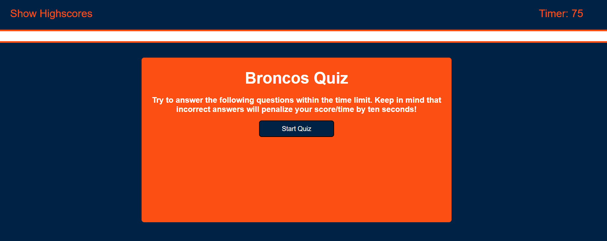

# Module4 Challenge: Coding Quiz

## Description

Write javascript code to create a multiple choice quiz that has a timer for given time to complete the quiz. An incorrect guess will reduce your allowed time by 10 seconds. At the end of the quiz your score is the time remaining and you are able to store your score to local storage.

## Tasks accomplished

<ul>
    <li>Used DOM traversal to update html elements on the page</li>
    <li>Used a timer to countdown the time remaining for the quiz</li>
    <li>Provided a score input to be stored to local storage</li>
</ul>

## Website Link

Link to deployed website is [Broncos Coding Quiz](https://larsonrj.github.io/codeQuiz/)

## Website Preview

